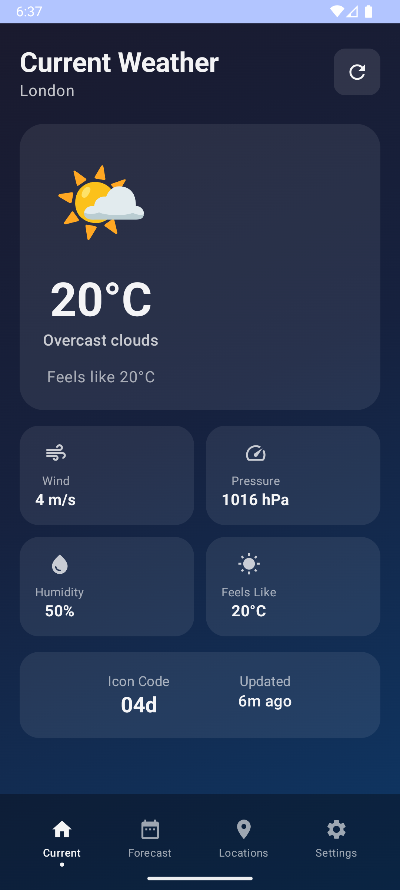
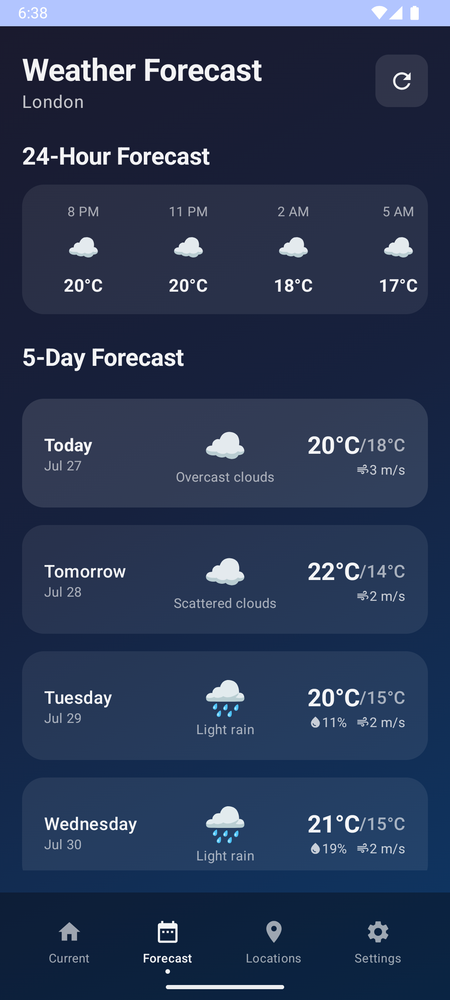

# WeatherNow 🌤️

A modern, beautiful Android weather application built with Jetpack Compose that provides real-time weather information and forecasts for locations worldwide.

## Screenshots

<div style="display: flex; flex-wrap: wrap; gap: 10px;">
  
  
  
  
</div>

*Beautiful, intuitive interface showcasing current weather, forecasts, saved locations, and customizable settings*

## Features

### 🌡️ Current Weather
- Real-time weather conditions with beautiful weather icons
- Temperature display with "feels like" temperature
- Detailed weather metrics: wind speed, pressure, humidity
- Weather condition descriptions
- Last updated timestamp and icon codes

### 📅 Weather Forecasts
- **24-Hour Forecast**: Hourly weather predictions with precipitation probability
- **5-Day Forecast**: Extended daily forecasts with high/low temperatures
- Detailed daily conditions including rain probability and wind speed

### 📍 Location Management
- Save multiple favorite locations
- Quick weather overview for all saved cities
- Easy location switching with one tap
- Add new locations with search functionality
- Remove locations with swipe gestures

### ⚙️ Customizable Settings
- **Units**: Switch between Fahrenheit/Celsius and different wind speed units
- **Notifications**: Weather alerts and change notifications
- **Privacy**: Location access controls
- **Appearance**: Dark/Light mode toggle
- **User Preferences**: Personalized weather experience

### 🎨 Modern UI/UX
- Built with Jetpack Compose for smooth, native Android experience
- Beautiful gradient backgrounds
- Glassmorphism design elements
- Smooth animations and transitions
- Responsive design for all Android devices

## Technologies Used

- **Language**: Kotlin
- **UI Framework**: Jetpack Compose
- **Architecture**: MVVM (Model-View-ViewModel)
- **Dependency Injection**: Hilt
- **Local Database**: Room
- **Weather API**: OpenWeatherMap API
- **Networking**: Retrofit/OkHttp
- **Image Loading**: Coil (for weather icons)
- **Testing**: JUnit, Mockito, Espresso

## Architecture

This app follows Clean Architecture principles with:

- **UI Layer**: Jetpack Compose screens and ViewModels
- **Domain Layer**: Use cases and business logic
- **Data Layer**: Repository pattern with Room database and API services
- **Dependency Injection**: Hilt for clean dependency management

## Installation

### Prerequisites

- Android Studio Arctic Fox or newer
- Android SDK 21+ (Android 5.0+)
- Kotlin 1.8+
- API key from [OpenWeatherMap](https://openweathermap.org/api)

### Setup

1. **Clone the repository**
   ```bash
   git clone https://github.com/KartikBhargava/WeatherNow.git
   cd WeatherNow
   ```

2. **Get your API key**
   - Sign up at [OpenWeatherMap](https://openweathermap.org/api)
   - Generate your free API key

3. **Configure the API key**
   - Create a `local.properties` file in the root directory
   - Add your API key:
   ```properties
   WEATHER_API_KEY="your_api_key_here"
   ```
   - Or add it to your `gradle.properties`:
   ```properties
   WEATHER_API_KEY=your_api_key_here
   ```

4. **Open in Android Studio**
   - Open Android Studio
   - Click "Open an existing project"
   - Navigate to the cloned directory
   - Wait for Gradle sync to complete

5. **Run the application**
   - Connect an Android device or start an emulator
   - Click the "Run" button or press `Shift + F10`

## Project Structure

```
app/
├── src/main/java/com/kartik/weathernow/
│   ├── data/
│   │   ├── local/          # Room database, DAOs, entities
│   │   ├── remote/         # API services, DTOs
│   │   └── repository/     # Repository implementations
│   ├── domain/
│   │   ├── model/          # Domain models
│   │   ├── repository/     # Repository interfaces
│   │   └── usecase/        # Business logic use cases
│   ├── presentation/
│   │   ├── ui/
│   │   │   ├── current/    # Current weather screen
│   │   │   ├── forecast/   # Forecast screen
│   │   │   ├── locations/  # Locations management
│   │   │   ├── settings/   # Settings screen
│   │   │   └── theme/      # UI theme and styling
│   │   └── viewmodel/      # ViewModels
│   ├── di/                 # Hilt dependency injection modules
│   └── util/               # Utility classes and extensions
├── src/test/               # Unit tests
└── src/androidTest/        # Instrumentation tests
```

## Key Dependencies

```kotlin
// UI
implementation "androidx.compose.ui:ui:$compose_version"
implementation "androidx.compose.material3:material3:$material3_version"
implementation "androidx.activity:activity-compose:$activity_compose_version"

// Architecture
implementation "androidx.lifecycle:lifecycle-viewmodel-compose:$lifecycle_version"
implementation "androidx.navigation:navigation-compose:$nav_version"

// Dependency Injection
implementation "com.google.dagger:hilt-android:$hilt_version"
implementation "androidx.hilt:hilt-navigation-compose:$hilt_compose_version"

// Database
implementation "androidx.room:room-runtime:$room_version"
implementation "androidx.room:room-ktx:$room_version"

// Networking
implementation "com.squareup.retrofit2:retrofit:$retrofit_version"
implementation "com.squareup.retrofit2:converter-gson:$retrofit_version"
```

## API Integration

The app integrates with OpenWeatherMap API for:

- **Current Weather**: Real-time weather data
- **5-Day Forecast**: Extended weather predictions
- **Geocoding**: Location search and coordinates
- **Weather Icons**: Condition-specific weather icons

## Testing

Run tests using Android Studio or command line:

```bash
# Unit tests
./gradlew test

# Instrumentation tests
./gradlew connectedAndroidTest

# Generate test reports
./gradlew jacocoTestReport
```

## Contributing

Contributions are welcome! Please follow these steps:

1. **Fork the repository**
2. **Create a feature branch**
   ```bash
   git checkout -b feature/amazing-feature
   ```
3. **Follow coding standards**
   - Use Kotlin coding conventions
   - Write meaningful commit messages
   - Add tests for new features
   - Update documentation as needed

4. **Commit your changes**
   ```bash
   git commit -m 'Add some amazing feature'
   ```
5. **Push to the branch**
   ```bash
   git push origin feature/amazing-feature
   ```
6. **Open a Pull Request**

### Development Guidelines

- Follow MVVM architecture pattern
- Use Jetpack Compose best practices
- Implement proper error handling
- Write unit tests for ViewModels and use cases
- Use Hilt for dependency injection
- Follow Material 3 design guidelines

## Roadmap

- [ ] Widget support for home screen weather
- [ ] Weather radar and maps integration
- [ ] Severe weather alerts
- [ ] Historical weather data
- [ ] Weather sharing functionality
- [ ] Multiple theme options
- [ ] Offline mode improvements
- [ ] Watch app companion

## Performance Optimizations

- Efficient Room database queries
- Image caching with Coil
- API response caching
- Optimized Compose recomposition
- Background location updates
- Battery-efficient weather updates

## License

This project is licensed under the MIT License - see the [LICENSE](LICENSE) file for details.

## Acknowledgments

- [OpenWeatherMap](https://openweathermap.org/) for providing weather data
- [Material Design 3](https://m3.material.io/) for design guidelines
- [Jetpack Compose](https://developer.android.com/jetpack/compose) for modern Android UI
- Weather icons and design inspiration from various sources

## Contact

**Kartik Bhargava**
- GitHub: [@KartikBhargava](https://github.com/KartikBhargava)
- LinkedIn: [Your LinkedIn Profile]

---

⭐ If you found this project helpful, please give it a star!

## Download

[](https://play.google.com/store/apps/details?id=com.kartik.weathernow)

*Replace with actual Google Play Store link when published*
